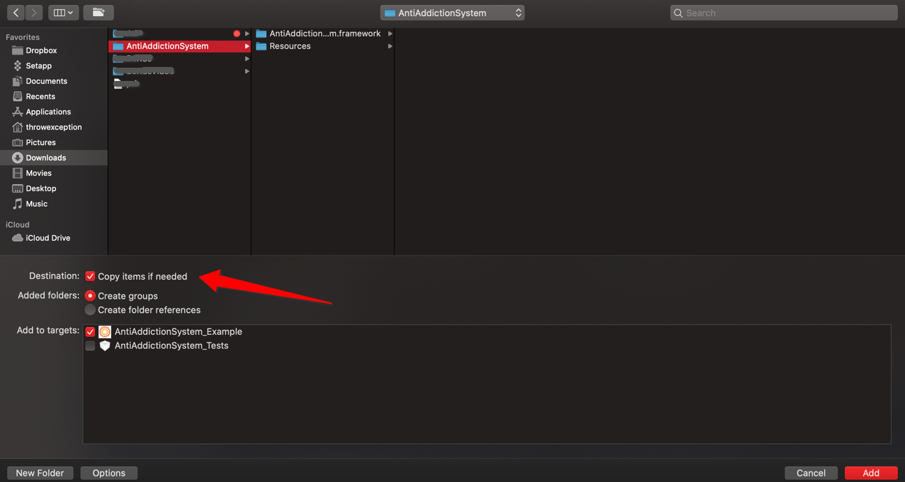

[See the English Guide](https://github.com/Atmosplay/AtmosplayAds-iOS/wiki)


# 入门指南

本指南适用于希望通过 AntiAddictionSystem-iOS 接入防沉迷功能的发布商。

# 前提条件

- 使用 Xcode 10.0 或更高版本。
- 使用 iOS 8.0 或更高版本。
- 在 info.plist 中添加如下ID,获取方式请咨询产品。
   ```
    <key>gamecode</key>
	<string>123</string>
	<key>zchannelid</key>
	<string>123</string>
	<key>zkey</key>
	<string>3756116173</string>
   ```

# 导入防沉迷 SDK
### 1. CocoaPods（首选）

要将该 SDK 导入 iOS 项目，最简便的方法就是使用 [CocoaPods](https://guides.cocoapods.org/using/getting-started)。  
请打开项目的 Podfile 并将下面这行代码添加到应用的目标中：  

```ruby
pod 'AntiAddictionSystem'
```

然后使用命令行运行：

```s
pod install --repo-update
```

如果您刚开始接触 CocoaPods，请参阅其[官方文档](https://guides.cocoapods.org/using/using-cocoapods)，了解如何创建和使用 Podfile。

### 2. 手动下载

1. 直接下载并解压缩 [SDK 框架](https://adsdk.yumimobi.com/iOS/AtmosplayAds/3.0.0_2019122001.tar.bz2)，然后将以下框架导入您的 Xcode 项目中：



2. 将 `-ObjC` 链接器标记添加到项目的 Build Settings 下的 `Other Linker Flags` 中：


3. 将以下动态库添加到您的工程中：
   - `AdSupport`

# 快速接入
### 1. 监听回调
您需要监听SDK的各项回调，依次进行app逻辑控制。
例如：
1. 当用户在提示界面点击登录按钮时，您需选择适合您应用的登录方式，展示登录界面。


```
// 导入头文件
#import <AntiAddictionSystem/AANotification.h>
// 遵循协议
@interface AAViewController ()<AANotificationDelegate>

@end

@implementation AAViewController

- (void)viewDidLoad
{
   [super viewDidLoad];
   // 设置AANotification的代理为当前类
   [AANotification shared].delegate = self;
}

// 监听回调
#pragma mark - notification delegate
// 隐私弹框已经展示
- (void)privacyPolicyViewControllerHasBeenShown {
    NSLog(@"AA---privacyPolicyViewControllerHasBeenShown");
}
// 用户同意隐私政策
- (void)userAgreesToPrivacyPolicy {
    NSLog(@"AA---userAgreesToPrivacyPolicy");
}

// 登录成功
- (void)loginSuccessWith:(NSString *)zplayKey {
    NSLog(@"AA---loginSuccess");
}
// 登录失败
- (void)loginFail {
    NSLog(@"AA---loginFail");
}
// 开始展示用户登录界面
- (void)loginViewControllerHasBeenShown {
    NSLog(@"AA---loginViewControllerHasBeenShown");
}
// 登录界面消失
- (void)loginViewControllerHasBeenDismissed {
    NSLog(@"AA---loginViewControllerHasBeenDismissed");
}
// 注销登录
- (void)loginOutSuccessfull {
    NSLog(@"AA---loginOutSuccessful");
}

// 实名认证界面已经展示
- (void)userAuthVcHasBeenShown {
    NSLog(@"AA---userAuthVcHasBeenShown");
}
// 实名认证成功
- (void)userAuthSuccessWithRemainTime:(NSNumber *)remainTime {
    NSLog(@"AA---userAuthSuccess");
}

// 提示界面已展示
// 可玩时长不足及不可支付时会弹出提示界面
- (void)warningVcHasBeenShown {
    NSLog(@"AA---warningVcHasBeenShown");
}

// 用户支付失败时，在提示界面点击登录
// 需在此调用适合您应用的登录方式
- (void)userClickLoginButtonInPaymentWarningVc {
   NSLog(@"AA---userClickLoginButtonInPaymentWarningVc");
}
// 用户游戏时长不足时，在提示界面点击登录
// 需在此调用适合您应用的登录方式
// 如用户在登录成功前关闭登录界面，应处理用户不可玩逻辑
- (void)userClickLoginButtonInNoTimeLeftWarningVc {
   NSLog(@"AA---userClickLoginButtonInNoTimeLeftWarningVc");
}
// 用户在提示界面点击退出游戏
- (void)userClickLoginOutButton {
    NSLog(@"AA---userClickLoginOutButton");
}

// 用户在提示界面点击确定
// 未成年用户支付失败情况
- (void)userClickConfirmButton {
    NSLog(@"AA---userClickConfirmButton");
}

// 支付前调用`checkNumberLimitBeforePayment:`检测用户是否可以支付
// 不可支付
- (void)paymentIsRestricted {
    [self addLog:@"paymentIsRestricted"];
    NSLog(@"AA---paymentIsRestricted");
}
// 可以支付
- (void)paymentUnlimited {
    [self addLog:@"paymentUnlimited"];
    NSLog(@"AA---paymentUnlimited");
}

@end
```

### 2. 展示隐私政策界面
隐私政策界面为SDK入口，请确保在应用启动时，调用此方法（确保根控制器已初始化）。
您无需判断用户是否已经同意隐私政策，SDK会自行判断。
用户同意隐私政策后，SDK会自动将其注册为游客状态。
```
// 导入头文件
#import <AntiAddictionSystem/AAPrivacyPolicyViewController.h>

@interface AAViewController ()<AANotificationDelegate>
@property (nonatomic) AAPrivacyPolicyViewController *privacyPolicyVC;

@end

@implementation AAViewController
- (void)viewDidLoad
{
    [super viewDidLoad];
    [AANotification shared].delegate = self;

}

- (void)viewDidAppear:(BOOL)animated {
    [self showPrivacyPolicyViewController];
}

- (void)showPrivacyPolicyViewController {
    self.privacyPolicyVC = [[AAPrivacyPolicyViewController alloc] init];
    [self.privacyPolicyVC showPrivacyPolicyViewWithRootViewController:rootViewController];
}
@end
```

### 3. 登录相关接口
在游客状态，您可以调用以下登录方式（四选一），将游客升级为正式用户。我们提供4指哪个登录方式，请根据您项目需求自行选择您需要的接口。
登录成功后，如用户未进行实名认证，SDK将自动弹出实名认证界面，如您未使用防沉迷SDK提供的登录界面，请确保您的登录界面消失后再调用如下方法。

#### 3.1. 使用防沉迷SDK提供的登录界面及接口
`注：若您的APP无登录功能、无登录界面，使用防沉迷SDK的登录功能可调用此接口`

登录界面由防沉迷SDK实现，你只需监听登录相关回调，判断用户是否登录成功，进行执行相应操作。
```
// 导入头文件
#import <AntiAddictionSystem/AALoginViewController.h>

@interface AAViewController ()<AANotificationDelegate>
@property (nonatomic) AALoginViewController *loginVc;

@end

@implementation AAViewController
- (void)showLoginViewController {
    self.loginVc = [[AALoginViewController alloc] init];
    [self.loginVc showLoginViewControllerWith:rootViewController];
}
@end
```

#### 3.2. 帐号密码登录接口
`注：若您的APP有登录页面，只需使用我方登录接口，可调用此接口`

如您使用自己的帐号体系，有登录界面，请通过接口将用户名、密码传递给防沉迷SDK。
```
// 导入头文件
#import <AntiAddictionSystem/AALogin.h>
@interface AAViewController ()<AANotificationDelegate>
@property (nonatomic) AALogin *loginManager;

@end

- (void)userNameAndPasswordLogin {
    self.loginManager = [[AALogin alloc] init];
    // 使用帐号密码注册
    // username: 用户帐号
    // password: 用户密码
    [self.loginManager loginWithUserName:@"userName" password:@"password" success:^(NSString * _Nonnull zplayID) {
    } 
    failure:^(NSError * _Nonnull error) {    
    }];
}
```

#### 3.3. 三方平台登录接口
`注：若您的APP已经接入微信登录、QQ登录等非ZPLAY登录，请调用此接口`

如您使用其他三方SDK进行登录，例如微信登录、QQ登录等，请调用以下方法，将其他登录平台返回的用户唯一标识通过以下接口传给防沉迷SDK进行登录。
```
// 导入头文件
#import <AntiAddictionSystem/AALogin.h>
@interface AAViewController ()<AANotificationDelegate>
@property (nonatomic) AALogin *loginManager;

@end

- (void)loginWithThirdParty {
    self.loginManager = [[AALogin alloc] init];
    // 使用第三方平台登录SDK
    // token: 如使用第三方登录（如微信），请使用三方登录SDK返回的唯一ID
    // otherID: 如果三方登录平台d返回除token之外的ID，请将此ID赋值给此参数
    // platformName : 三方平台名称（请联系产品获取）
    [self.loginManager loginWithPlatformToken:@"token" otherID:@"otherID" platformName:@"wx"];
}
```

#### 3.4. ZPLAY封装的三方登录SDK接口
`注：如您使用Zplay封装的三方登录SDK，请使用以下接口`

请在获取到了登录成功后的zplayID后，使用下面的接口，请在登录成功后将zplayID传递给防沉迷SDK进行登录。
```
// 导入头文件
#import <AntiAddictionSystem/AALogin.h>
@interface AAViewController ()<AANotificationDelegate>
@property (nonatomic) AALogin *loginManager;

@end

- (void)loginWithZplayID {
    self.loginManager = [[AALogin alloc] init];
    // 使用Zplay登录SDK
    [self.loginManager loginWithZplayID:@"zplayID"];
}
```

### 4. 退出用户登录状态
如您有切换帐号功能或退出账号登录动能，请调用此接口，注销当前用户的登录状态。
```
// 导入头文件
#import <AntiAddictionSystem/AALogin.h>
@interface AAViewController ()<AANotificationDelegate>
@property (nonatomic) AALogin *loginManager;

@end

- (void)loginOut {
    self.loginManager = [[AALogin alloc] init];
    // 使用Zplay登录SDK
    [self.loginManager loginOut];
}
```

### 5. 实名认证接口
用户处于游客状态时，您可以根据应用需求决定是否提示用户进行实名认证，若需要用户进行实名认证，请调用以下接口。
如果用户已登录即非游客模式，您不需关心用户实名认证状态，防沉迷SDK将自动处理。
```
// 导入头文件
#import <AntiAddictionSystem/AAUserAuthenticationViewController.h>

@interface AAViewController ()<AANotificationDelegate>
@property (nonatomic) AAUserAuthenticationViewController *authVc;

@end

@implementation AAViewController
- (void)showAuthViewController {
    self.authVc = [[AAUserAuthenticationViewController alloc] init];
    [self.authVc showUserAuthenticationViewControllerWith:rootViewController];
}
@end
```

### 支付相关接口
根据国家规定，对未成年人在游戏中的单笔付费金额和每月累计付费金额都有限制，因此在用户发起支付时需要调用`判断本次用户购买是否可以支付接口`口，用户购买成功后需要调用`用户支付成功上报`接口。

#### 1. 判断本次用户购买是否可以支付接口
用户购买前，调用此接口监测本次用户是否可以支付，返回可以支付后才可发起支付、
您可通过监听`paymentIsRestricted`,`paymentUnlimited`获知用户是否可以支付。
```
// 导入头文件
#import <AntiAddictionSystem/AAPayNumberReport.h>
@interface AAViewController ()<AANotificationDelegate>
@property (nonatomic) AAPayNumberReport *payReport;

@end

@implementation AAViewController

- (void)payMethodOne {
    self.payReport = [[AAPayNumberReport alloc] init];
    // 支付前检查用户是否被限额（成年人不受限制）
    // paynumber: 付费金额，单位分
    [self.payReport checkNumberLimitBeforePayment:payNumber];
}
@end
```

#### 2. 用户支付成功上报
用户支付成功后，需将用户本次购买金额上报给防沉迷系统。

```
// 导入头文件
#import <AntiAddictionSystem/AAPayNumberReport.h>
@interface AAViewController ()<AANotificationDelegate>
@property (nonatomic) AAPayNumberReport *payReport;

@end

@implementation AAViewController

- (void)payMethodOne {
    self.payReport = [[AAPayNumberReport alloc] init];
    // 支付成功后上报玩家支付金额
    // payNumber: 付费金额，单位分
    [self.payReport reportNumberAfterPayment:payNumber];
}
@end
```
### 其他接口
#### 1. 获取用户登录状态接口
请使用下面的接口获取当前用户的登录状态

```
typedef enum : NSUInteger {
    // 未知
    AAUserLoginUnknow,
    // 游客
    AAUserNotLogin,
    // 正式用户
    AAUserIsLogin
}AAUserLoginStatus;
```

```
#import <AntiAddictionSystem/AANotification.h>
@interface AAViewController ()<AANotificationDelegate>
@property (nonatomic) AALogin *loginManager;

@end

@implementation AAViewController
- (void)getUserLoginStatusMethod {
   AAUserLoginStatus loginStatus = 0;
   self.loginManager = [[AALogin alloc] init];
   loginStatus = [self.loginManager getUserLoginStatus];
}
@end
```
#### 2. 获取用户实名认证状态接口
调用下面接口获取当前用户的实名认证身份

```
typedef enum : NSUInteger {
    // 未知
    AAUserAgeUnknow,
    // 已成年
    AAUserAdult,
    // 未成年
    AAUserUnderAge
}AAUserAgeGroup;
```

```
#import <AntiAddictionSystem/AANotification.h>
@interface AAViewController ()<AANotificationDelegate>
@property (nonatomic) AALogin *loginManager;

@end

@implementation AAViewController
- (void)getUserAuthStatusMethod {
   AAUserAgeGroup authStatus = 0;
   self.loginManager = [[AALogin alloc] init];
   authStatus = [self.loginManager getUserAuthenticationIdentity];
}
@end

```
